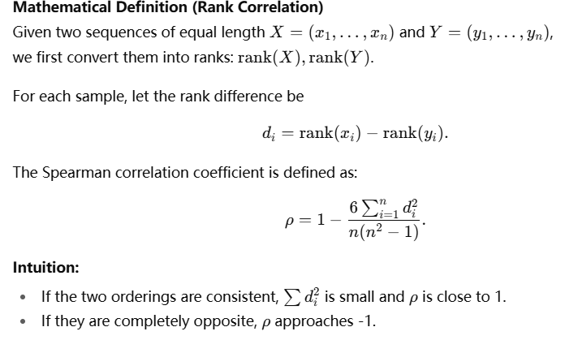

# Documents_description

1. Task2

   - task2_llm_results.json

     ```html
     query: "films suitable for Chinese people" → the user’s question.
     
     model: "gpt-4o-mini" → the LLM used.
     
     table: "film" → the matched table name.
     
     score: 5 → relevance score (higher means more relevant).
     
     reason: "Directly provides film titles and details." → why it was chosen.
     
     summary: Explains what the table is about (film information for rental systems).
     
     columns: List of fields in the table, e.g.:
     
     film_id: unique film identifier.
     
     title: the film’s title.
     
     description: a short summary of the film.
     
     release_year: the year the film was released.
     ```

2. Task3

   - task3_eval.jsonl

     *This file is used to create **`task3_examples.md`** and **`task3_reflection.md`**.*

     ```python
     This file mainly stores the Task 2 relevance scores and the Task 3 evaluation ratings.
     
     why explains why a table is considered relevant or not.
     
     missing_info lists the information that is missing, which makes the table insufficient to fully answer the query.
     
     irrelevant_info highlights the attributes in the table that are unrelated to the query.
     ```

   - task3_examples.md

     *Visualize the contents of the `task3_eval.jsonl` file.*

   - task3_reflection.md

     - top1 judgment: If the top-1 most relevant table returned by Task 2 and Task 3 is the same, return **Yes**; otherwise, return **No**.

     - Spearman Correlation Coefficient

     

     

# Example_Task2-3

## Query1

- queries 1-2 are  vague queries
- queries 3-4 are  specific queries

1. query

   ```python
   python task2_search.py "films suitable for Chinese people" --k 5
   ```

2. task3_result

   ```pythonn
   **Task3 rating:** 3  ❌ not sufficient
   - **Why:** The table contains information about various films, including titles, descriptions, and ratings.; It may provide context on film availability but lacks specific cultural or content suitability filters for Chinese audiences.
   - **Missing info:** Cultural context, themes, or tags indicating suitability for Chinese people; Language preferences beyond just language IDs
   - **Irrelevant info:** Rental details like rental duration and rental rate; Special features that might not relate to cultural suitability
   ```

## Query2

1. query

   ```python
   python task2_search.py "Can u recommend some films for people who like action movies ?" --k 5
   ```

2. task3_result

   ```python
   **Task3 rating:** 3  ❌ not sufficient
   - **Why:** The table contains film titles and descriptions which can provide options for recommendations.; It includes a rating column which could help identify suitable action films if they are categorized.
   - **Missing info:** Genre information to filter specifically for action movies.
   - **Irrelevant info:** Rental details like rental_duration and rental_rate are not directly useful for film recommendations.
   ```

## Query3

1. query

   ```python
   python task2_search.py "Do u have the email of SMITH ?" --k 5
   ```

2. task3_result

   ```python
   **Task3 rating:** 5  ✅ sufficient
   - **Why:** Table contains an 'email' field.; Includes 'first_name' and 'last_name' which can be used to filter for 'SMITH'.; Addresses customer details relevant to the query.
   - **Irrelevant info:** store_id; address_id; active; create_date; last_update
   ```

## Query4

1. query

   ```python
   python task2_search.py "Which movie was released in 2006 ?" --k 5
   ```

2. task3_result

   ```python
   **Task3 rating:** 5  ✅ sufficient
   **Why:** Table includes 'release_year' which is essential for the query.; Contains multiple films released in 2006, providing direct answers.
   ```


## Conclusion

The LLM did identify the most relevant table, but its final judgment may be inaccurate, especially for vague queries. For example, when asked to find “films suitable for Chinese people,” it correctly pointed to the film table but did not assign the highest score (5). In my view, there are two reasons:

1. The language_id field in the film table is stored as a numeric code, which must be joined with the separate language table. Relying on language_id alone cannot determine the actual language.

2. Even knowing the language is not sufficient to decide whether a film is suitable for Chinese viewers.